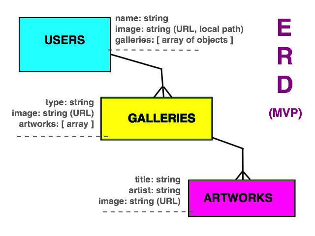
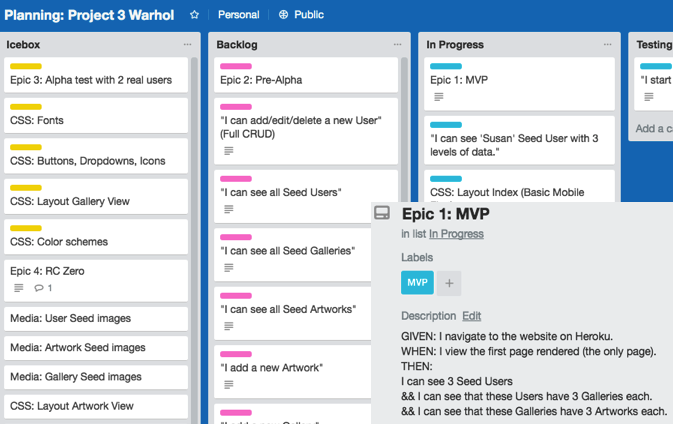

# Art Dealer / Gallery Showroom App

By Jeremy Abernathy

Project #3, WDI-13


###### Above: Some pieces from the board game [The Gallerist](https://boardgamegeek.com/boardgame/125153/gallerist), one of my inspirations for this project. 

## Deployed link 

Two versions of this app:

* Ruby on Rails, [current version deployed here!](https://warhol-inv.herokuapp.com/)

* Or see the MongoDB, [version here](https://github.com/Jabernathy88/react-project-warhol)

## Project summary & Self-review

In this app, you play the part of a prestigious art dealer. After creating your user account (full CRUD), you can create an art gallery (or several galleries) and then create or select paintings to display in your new space. 

**Technologies used:** HTML5, CSS Grid, Flexbox, Javascript, jQuery, Node.js, Express, MongoDB, Mongoose, React, Styled Components, Axios.

**My approach:** I focused on a smaller scale MVP before working on the full list of deliverables, drawing inspiration from Eric Reis's concept of "minimum value" rather than "minimum viable" (from [The Lean Startup](https://www.amazon.com/Lean-Startup-Entrepreneurs-Continuous-Innovation/dp/0670921602/ref=tmm_pap_swatch_0?_encoding=UTF8&qid=1517406597&sr=8-3)).

**Unsolved problems:** I'm very happy about achieving full CRUD for my top-level data (Users), as well as create, read, and update functions for the second-level (Galleries). But I definitely would want full CRUD functioning for all three levels in the next version.

Visually, I like the tight layout for mobile views. Later I'll try a more ambitious layout for desktop as well.  

Link to [grading rubric](https://git.generalassemb.ly/atl-wdi/wdi-curriculum/blob/master/projects/unit_03/README.md). 

## Data Models / ERD



###### Above: Users have Galleries have Artworks (entities and relationships).

I created a visual diagram, as well as some example code showing what my Schema file might look like in Javascript.

* Live demo at [Repl.it here](https://repl.it/@Jabernathy88/Warhol-Example-SeedSchema)

* Plain snippet underneath the arrow button:

<details>
	<summary>Susan Bishop: Sample User Data</summary>
	
```
const userSusan = {
  name: "Susan Bishop",
  galleries: [
    {
      name: "Whitespace",
      artworks: [
        {
          name: "Girl With Pearl Earring",
          artist: "Vermeer",
          img: `../public/img/vermeer_girl-w-pearl1.jpg`
        }, {
          name: "Starry Night",
          artist: "Van Gogh",
          img: `../public/img/vermeer_girl-w-pearl1.jpg`
        }, {
          name: "Mona Lisa",
          artist: "Leo",
          img: `../public/img/vermeer_girl-w-pearl1.jpg`
        }, {
          name: "School of Athens",
          artist: "Raphael",
          img: `../public/img/vermeer_girl-w-pearl1.jpg`
        }, {
          name: "Elvis Presley Print",
          artist: "Andy Warhol",
          img: `../public/img/vermeer_girl-w-pearl1.jpg`
        }
      ]
    }, {
      name: "Saltworks",
      artworks: [
        {
          name: "School of Athens 2",
          artist: "Raphael",
          img: `../public/img/vermeer_girl-w-pearl1.jpg`
        }, {
          name: "Elvis Presley Print 2",
          artist: "Andy Warhol",
          img: `../public/img/vermeer_girl-w-pearl1.jpg`
        }
      ]
    }, {
      name: "Pepperworks",
      artworks: [
        {
          name: "School of Athens 3",
          artist: "Raphael",
          img: `../public/img/vermeer_girl-w-pearl1.jpg`
        }, {
          name: "Elvis Presley Print 3",
          artist: "Andy Warhol",
          img: `../public/img/vermeer_girl-w-pearl1.jpg`
        }
      ]
    }
  ]
}
```

So Susan has 3 galleries, each with 2-5 paintings on view.
</details>

## Wireframes


Focusing on mobile design first. Going with Andy Warhol-esque colors for now.  

## Trello Board Planning



###### Above: Putting extra effort into defining a clear MVP.

User stories [planning here.](https://trello.com/b/Dhr6NX2o/planning-project-3-warhol)

This time I'm using color-coded cards in Trello to divide my User Stories into several groups, or "epics," within the development process. These epics should help me quickly finish my MVP, stay focused on key milestones, and stick to the Agile mindset. 

That's it for now! Getting back to work. 

-JA